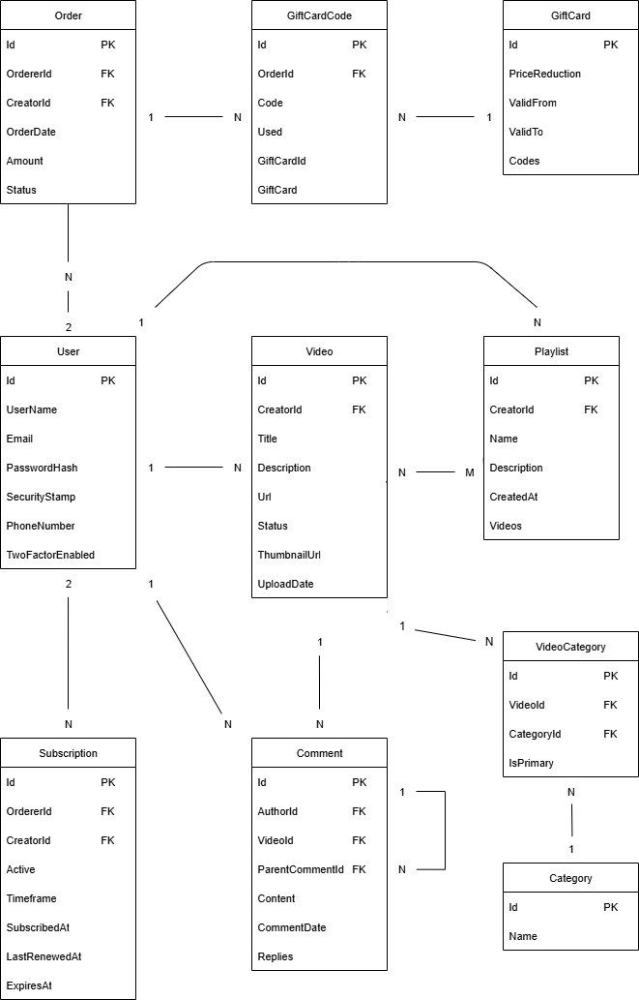

# PV179 - project
### Authors
- Josef Kuchař
- Jiří Štípek
- Andrej Nešpor

### Description
This project is a web platform inspired by Herohero, where creators can share video content and connect with their audience.
Users can:

- Create profiles and upload videos
- Subscribe to their favorite creators
- Build and manage playlists
- Comment on videos

The application is built with ASP.NET Core MVC and uses a multi-layered architecture to keep the codebase clean, maintainable, and easy to extend.

### Prerequisites
Required:
- [.NET 8 SDK](https://dotnet.microsoft.com/en-us/download/dotnet) (8.0.x)
- [Docker Desktop](https://www.docker.com/products/docker-desktop/) with Docker Compose v2
- [Git](https://git-scm.com/downloads)

Optional:
- Visual Studio 2022 or VS Code
- EF Core CLI: `dotnet tool install -g dotnet-ef`
- PostgreSQL client (psql) for debugging
- Postman (for testing API endpoints)

### Application start
To run the application locally, you need Docker installed.

1. **Clone the repository**
```bash
git clone https://gitlab.fi.muni.cz/xkuchar/pv179-project.git
cd pv179-project
```

2. **Start the database**
```bash
docker compose up -d
```
This starts a PostgreSQL instance defined in `docker-compose.yml`.

3. **Build the solution**
```bash
dotnet build
```

4. **Run the solution**
```bash
dotnet run
```
On first start, the API will:
- Apply EF Core migrations automatically
- Seed sample data in Development environment

5. **Open your browser** (replace the port if different in console output)
```
http://localhost:5076
```

## Technical overview
- .NET 8, C#
- ASP.NET Core:
  - API project with REST controllers and Swagger
  - MVC project with Razor Pages Identity UI
- Entity Framework Core (Code First) with PostgreSQL (via Docker Compose)
- Serilog logging: console sink and PostgreSQL sink (configured in `API/appsettings.json`) + `UseSerilogRequestLogging()`
- EF Core audit logging to `AuditLogs` table (entity create/update/delete)
- Layered architecture: DAL, Infra, Business, Common, API, MVC
- GitLab CI/CD for automated build/test validation

### Search & Filtering
- Users can search across videos, playlists, and creators.
- Sidebar filters allow narrowing results by:
  - **Content type** (videos, playlists, creators)
  - **Video categories**
  - **Date range**
  - **Sorting** (by title, date created, last updated)
- Category filter is context-aware and only visible when searching for videos.
- Pagination is supported for large result sets.

### Video Detail Page
- Each video has a dedicated detail page with:
  - Video, title, description, upload date, and creator info
  - List of assigned categories

### Video Categories
- Each video has one **primary** category
- Each video can have multiple **secondary** categories

### Gift Cards
- Gift cards are special products that can be purchased and redeemed for credit or discounts on the platform.
- Each gift card can have multiple unique codes (`GiftCardCode`), which can be distributed to users.
- The value of the gift card is applied to the purchase (e.g., as a discount or credit).
- Gift cards and their codes are visible in the user's order history if used.

### Orders
- Each order (`Order`) tracks:
  - The buyer (orderer) and the seller (creator)
  - The order date, amount, and current status (pending, completed, failed)
  - Linked gift card code if a gift card was used for the purchase
  - Timeline information (created, updated)
- Users can view their order history on the **My Orders** page, which lists all their past and current orders.
- Each order in the list can be clicked to view a detailed **Order Detail** page, which shows:
  - All order information (status, amount, parties, timeline)
  - The gift card code used (if any)
  - Contextual alerts for payment status (pending, completed, failed)

### Subscription & Purchase Flow

- Each creator (user) has a simple public detail page, where users can view their profile and content.
- Clicking **Subscribe** starts the purchase process for a subscription to the selected creator.
- In the purchase process, the user can immediately enter a **gift card code** to apply a discount or credit.
- The user then confirms the purchase by clicking the **Pay** button.
- After payment, the system creates both a **Subscription** (linking the user to the creator) and an **Order** (tracking the transaction, payment status, and any applied gift card).

### Audit logger
Entity changes are recorded into an `AuditLogs` table automatically during `SaveChanges`/`SaveChangesAsync`.
- Scope: currently logs `Video` entity create/update/delete operations
- Captured fields: `UserId`, `Table`, `EntityId`, `Action` (`Create|Update|Delete`), `CreatedAt`, `UpdatedAt`
- Source: appended by `AppendAuditLogs()` in `DAL/Data/AppDbContext`
- Migrations: table is created by EF migrations and applied on API startup

This can be extended to other entities by adjusting the logic in `AppendAuditLogs()`.

### Identity authentication
Authentication is handled by ASP.NET Core Identity with the custom `User` entity stored via EF Core in PostgreSQL, exposed through Razor Pages UI.
- Registration in MVC: `AddIdentity<User, IdentityRole>()` + `AddEntityFrameworkStores<AppDbContext>()` + `AddDefaultTokenProviders()`
- Email sender: `IEmailSender` registered (development stub in `MVC.Services.EmailSender`)
- Docs: https://learn.microsoft.com/aspnet/core/security/authentication/identity

### Admin Interface
The platform includes a dedicated admin interface for advanced management and administration tasks. Administrators can:

- **User management:** Manage users, assign and change roles, and reset user passwords.
- **Order management:** View, edit, and manage all orders across the platform.
- **Playlist management:** Create, edit, and delete playlists.
- **Video management:** Manage videos, including editing, approving, or removing content.
- **Subscription management:** Oversee and manage user subscriptions.
- **Gift card management:** Create, edit, and delete gift cards; generate and remove gift card codes.
- **Category management:** Create, edit, and delete video categories.

The admin interface is accessible only to users with administrative privileges and provides a secure environment for platform maintenance and oversight.

### Architecture
The project is divided into several layers, each with its own clear purpose:

1. **Data Access Layer (DAL)**
handles everything related to the database — defining entities, managing migrations, and implementing repositories for data operations.

2. **Business Layer (BL)**
contains the application’s core logic. This is where the main features are implemented — such as managing subscriptions, playlists, or comments.

3. **Application Layer (API)**
exposes REST endpoints that connect the MVC frontend (or external services) with the Business layer.

4. **Model-View-Controller Layer (MVC)**
provides the user interface and handles web requests. It includes controllers and view models that define how data is displayed and interacted with.

Each layer communicates only with the one directly below it, ensuring a clean separation of responsibilities.

### Logging middleware
Both the API and MVC projects configure Serilog for logging (console sink by default).  
A request logging middleware (`UseSerilogRequestLogging`) emits structured logs for each HTTP request (method, path, status code, duration) in both projects.

Request logs themselves are not written directly to the database. Persistent logging to the database is achieved through the EF Core audit mechanism (see the Audit logger section) which stores entity change events in the `AuditLogs` table.

To also persist request logs into PostgreSQL you could add a Serilog PostgreSQL sink (e.g. `Serilog.Sinks.PostgreSQL`) and register it in the initial Serilog configuration.

### GitLab CI/CD and Repository Setup
The repository is configured with **GitLab CI/CD** for automated build/test validation.

Key settings include:
- **Protected branches** to ensure that only approved changes can be merged into main development branches.
- **Required reviewers** for merge requests, enforcing code quality and peer review.

### Tests
The repository includes unit tests under `Business.Tests` (xUnit + Moq) that exercise Business layer services without touching the database.
- Frameworks: xUnit, Moq, Microsoft.NET.Test.Sdk
- Test project: `Business.Tests/Business.Tests.csproj`

Existing test suites:
- `Business.Tests/VideoServiceTests.cs` — covers Create/GetAll/GetById/GetByFilter/Update/Delete scenarios for `VideoService`.
- `Business.Tests/OrderServiceTests.cs` — covers Create/GetAll/GetById/Update/Delete scenarios for `OrderService`.
- `Business.Tests/UserServiceTests.cs` — file present but currently contains no implemented tests.

How tests mock dependencies:
- Repositories (`IVideoRepository`, `IUserRepository`, `IOrderRepository`, etc.) are mocked with Moq (strict mocks) to verify interactions and capture passed entities.

Run tests:
```bash
# run all tests in the solution
dotnet test

# run only the Business.Tests project
dotnet test Business.Tests/Business.Tests.csproj
```

## Use case diagram

## Data model

